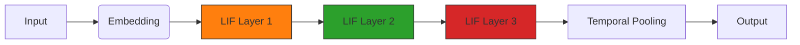

# 🧠💬 Conversational Spiking Neural Network (SNN)

**A biologically-inspired chatbot implementing spike-based learning with STDP and temporal pooling.**

[](https://www.python.org/downloads/)

<br>

## ✨ Key Features

*   **Spike-Timing Dependent Plasticity (STDP):**  Local temporal learning through spike correlation.
*   **Temporal Pooling:** Time-step aggregation for enhanced temporal processing.
*   **Hybrid Learning:** Combines STDP with backpropagation for stable training.
*   **Spike Visualization:** Interactive raster plots of layer-wise activity.
*   **Movie Dialogue Training:** Pre-trained on a movie conversation dataset.

<br>

## 🏛️ Architecture



<br>

## 🚀 Quick Start

### 📦 Installation

```bash
git clone https://github.com/yourusername/conversational-snn.git
cd conversational-snn
pip install -r requirements.txt
```

### ⚙️ Requirements

*   Python 3.8+
*   `snntorch>=0.6`
*   `torch>=1.12`
*   `matplotlib>=3.5`
*   `tqdm>=4.64`

<br>

### 🕹️ Usage

1.  **Preprocess Data:**

    Place your `movie_lines.txt` in the `data/` directory and run:

    ```bash
    python initialize.py
    ```

2.  **Train Model:**

    Start training with hybrid STDP-backprop:

    ```bash
    python train.py
    ```
    Visualizations will be saved to the `visualizations/` directory.

3.  **Chat with Model:**

    Launch the interactive chatbot:

    ```bash
    python chat.py
    ```

<br>

## 💡 Technical Highlights

### Network Architecture

```python
class DialogueSNN(nn.Module):
    def __init__(self, vocab_size, hidden_size=256):
        super().__init__()
        # 3-layer LIF architecture
        self.embed = nn.Embedding(vocab_size, 128)
        self.fc1 = nn.Linear(128, 256)
        self.lif1 = snn.Leaky(beta=0.85)
        # ... (additional layers)
```

### Hybrid Learning

```python
# Combined STDP-backprop update
param.grad = (0.7 * backprop_grad + 0.3 * stdp_grad)
```

### Visualization Example

**Spike Raster Plot**  _ (Include an actual spike raster plot image here.  Find one generated by your code and upload it to the repository, then link it here)_

  _Replace `link/to/spike_raster_plot.png` with the correct path_

<br>

## 🙌 Contributing

Pull requests are welcome! Key development areas include:

*   Improved STDP rules
*   Attention mechanisms
*   Larger pretrained models

<br>

## 📜 License

Copyright (c) 2025 Grant Arrington
All Rights Reserved.
See [LICENSE](LICENSE) for details.